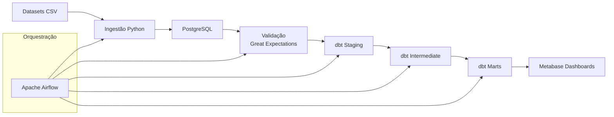
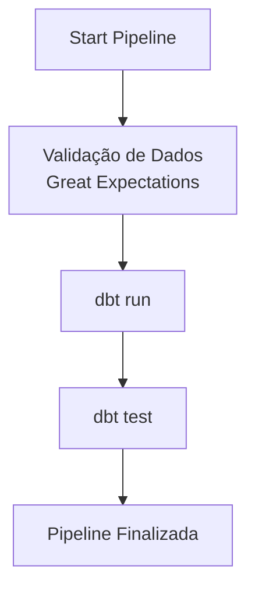
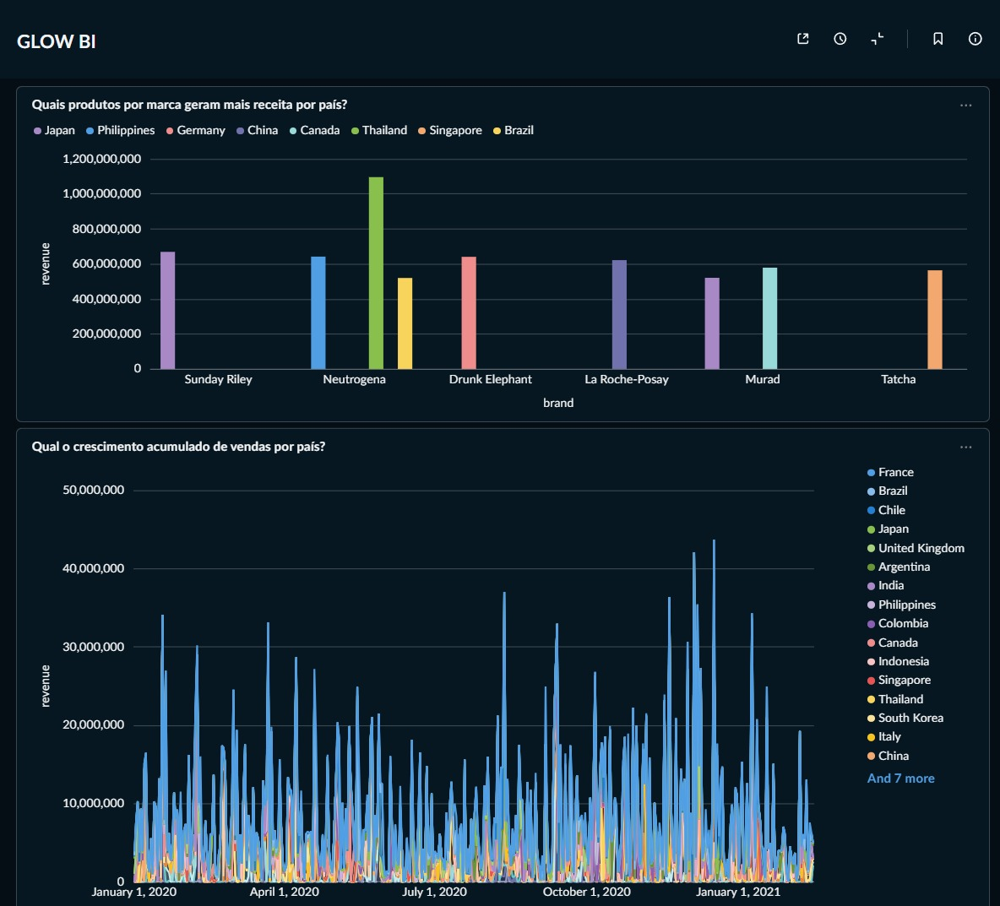
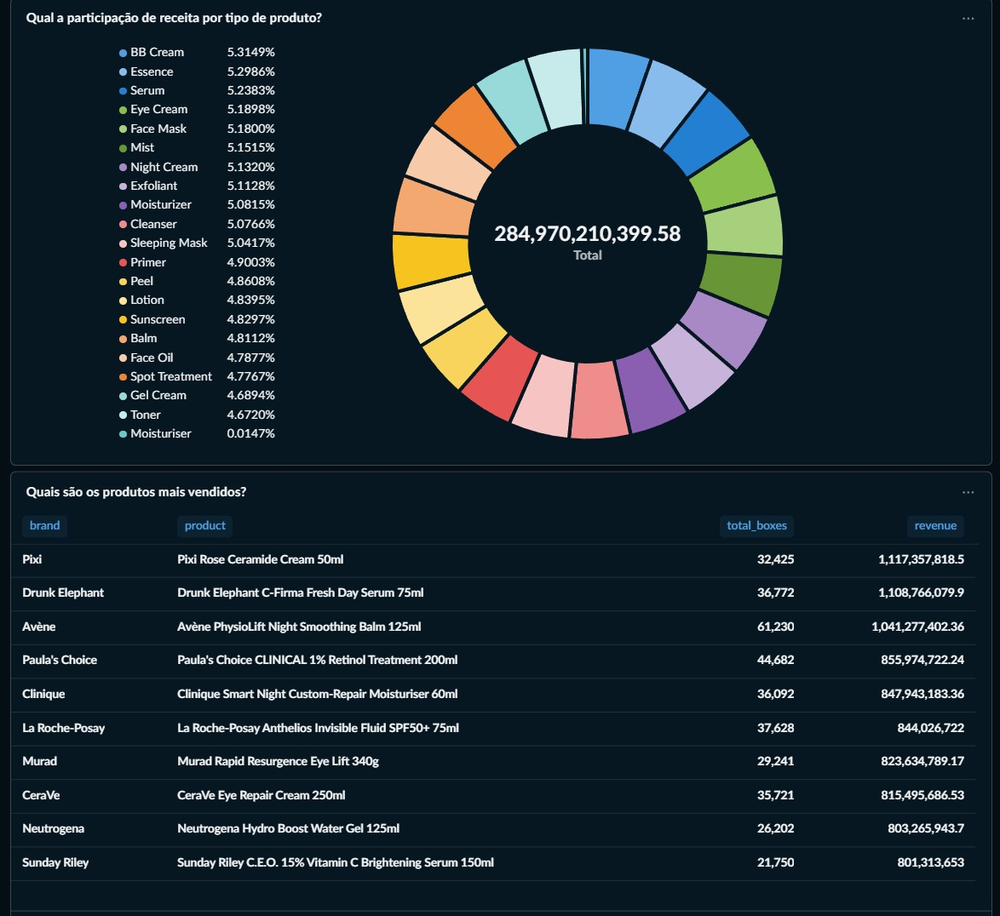

# Glow & Co. --- Pipeline de Dados para Beauty Intelligence

------------------------------------------------------------------------

# 📊 Visão Geral

O **Glow & Co. Beauty Intelligence Pipeline** é uma plataforma de
**engenharia de dados baseada em ELT**, construída para analisar dados
de produtos de beleza, ingredientes e vendas.

A pipeline realiza:

-   ingestão de datasets de cosméticos e skincare
-   validação de qualidade dos dados
-   transformações analíticas
-   disponibilização de dados para dashboards

O projeto demonstra uma arquitetura moderna de **Data Engineering**
utilizando:

-   Python
-   PostgreSQL
-   Great Expectations
-   dbt
-   Apache Airflow
-   Docker
-   Metabase

------------------------------------------------------------------------

# 🎯 Objetivo do Projeto

A Glow & Co. busca usar dados para orientar decisões estratégicas no
desenvolvimento de produtos.

A pipeline permite responder perguntas como:

-   Quais **combinações de ingredientes** estão associadas a melhores
    avaliações?
-   Existe um **limite de ingredientes** onde a qualidade percebida não
    aumenta mais?
-   Como **faixas de preço** influenciam avaliações e vendas?
-   Existem padrões entre **ingredientes e desempenho de vendas**?

------------------------------------------------------------------------

# 🏗 Arquitetura da Pipeline

A arquitetura segue um modelo **ELT em múltiplas camadas**, separando
ingestão, validação, transformação e consumo analítico.

------------------------------------------------------------------------

# 🧰 Stack Tecnológica

  Camada           Tecnologia
  ---------------- --------------------
  Ingestão         Python
  Banco de dados   PostgreSQL
  Validação        Great Expectations
  Transformações   dbt
  Orquestração     Apache Airflow
  Visualização     Metabase
  Infraestrutura   Docker

------------------------------------------------------------------------

# 📂 Estrutura do Projeto

    ProjetoFinal-Grupo6
    │
    ├── airflow/
    │   └── dags/
    │       └── dag1.py
    │
    ├── base/
    │   ├── cosmetics.csv
    │   ├── cosmetics_sales_data.csv
    │   └── skincare_products_clean.csv
    │
    ├── bronze/
    │   └── ingest.py
    │
    ├── silver/
    │   └── silver.py
    │
    ├── gold/
    │   └── gold.py
    │
    ├── validation/
    │   ├── expectation_validation_raw_cosmetics.py
    │   ├── expectation_validation_raw_products.py
    │   ├── expectation_validation_raw_sales.py
    │   └── gx_run.py
    │
    ├── glow_dbt/
    │   ├── models/
    │   │   ├── staging/
    │   │   ├── intermediate/
    │   │   └── marts/
    │   └── dbt_project.yml
    │
    ├── sql/
    │   └── init.sql
    │
    ├── frontend/
    │   └── metabase_data/
    │
    ├── provisioning/
    │   └── metabase_setup.py
    │
    ├── images/
    ├── docker-compose.yml
    └── Dockerfile

------------------------------------------------------------------------

# 🔄 Camadas da Pipeline

## Base

Contém os **datasets originais** utilizados no projeto.

Exemplos:

-   dados de cosméticos
-   dados de vendas
-   dados de produtos de skincare

------------------------------------------------------------------------

## Bronze

Responsável pela **ingestão dos dados brutos** no banco PostgreSQL.

Script principal:

    bronze/ingest.py

------------------------------------------------------------------------

## Silver

Camada de **padronização e limpeza dos dados**.

Script:

    silver/silver.py

------------------------------------------------------------------------

## Gold

Camada final com **dados preparados para análise e BI**.

Script:

    gold/gold.py

------------------------------------------------------------------------

# ✔ Validação de Dados

A qualidade dos dados é verificada com **Great Expectations**.

Localização:

    validation/

As validações incluem:

-   verificação de valores nulos
-   consistência de colunas
-   validação de schemas
-   verificação de integridade

------------------------------------------------------------------------

# 🔧 Transformações Analíticas com dbt

O **dbt (Data Build Tool)** é utilizado para construir modelos
analíticos.

Estrutura:

### Staging

Padronização inicial das tabelas raw.

Exemplos:

-   stg_cosmetics_products
-   stg_sales_data
-   stg_skincare_products

------------------------------------------------------------------------

### Intermediate

Combinação e enriquecimento dos datasets.

Exemplos:

-   análise de pares de ingredientes
-   unificação de produtos
-   enriquecimento de dados de vendas

------------------------------------------------------------------------

### Marts

Modelos analíticos finais para BI.

Exemplos:

-   estatísticas de ingredientes
-   quartis de preço
-   segmentação de produtos
-   análises de vendas

------------------------------------------------------------------------

# ⚙ Orquestração com Apache Airflow

A execução da pipeline é controlada por uma **DAG do Airflow**.

Arquivo:

    airflow/dags/dag1.py

## Diagrama da DAG

------------------------------------------------------------------------

# 📈 Visualização de Dados

Os dados transformados são explorados através de **dashboards no
Metabase**.

Localização da configuração:

    frontend/metabase_data

Os dashboards consomem diretamente os **data marts produzidos pelo
dbt**.

## Dashboards do Metabase

------------------------------------------------------------------------

# 🚀 Executando o Projeto

### 1️⃣ Clonar o repositório

    git clone https://github.com/leticiacipriano-code/ProjetoFinal-Grupo6.git

------------------------------------------------------------------------

### 2️⃣ Subir os containers

    docker-compose up -d

------------------------------------------------------------------------

### 3️⃣ Executar a pipeline

Ativar a DAG no Airflow:

    pipeline_elt_glow_dag

------------------------------------------------------------------------

# 📷 Evidências do Projeto

A pasta:

    images/

contém prints relacionados à execução do dbt, como:

-   dbt seed
-   dbt run
-   dbt debug

------------------------------------------------------------------------

# 🔮 Melhorias Futuras

Possíveis evoluções:

-   ingestão incremental
-   monitoramento e alertas
-   observabilidade de dados
-   novos dashboards analíticos
-   integração com novas fontes de dados

------------------------------------------------------------------------

# 🧠 Conclusão

Este projeto demonstra uma **pipeline moderna de engenharia de dados
ponta a ponta**, incluindo:

-   ingestão de dados
-   validação de qualidade
-   modelagem analítica
-   orquestração de workflows
-   disponibilização de dados para análise

A solução permite transformar dados brutos em **insights analíticos para
apoiar decisões estratégicas da Glow & Co.**
